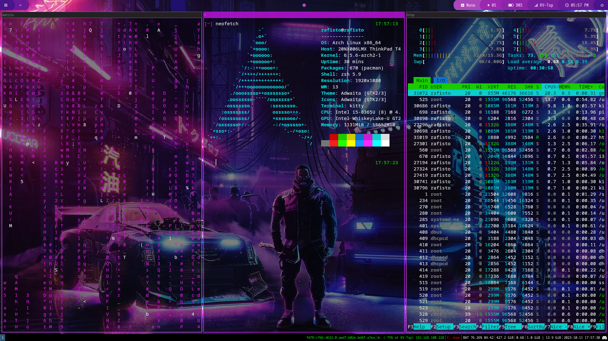

### Quick rice - Arch Linux + i3wm, i3status, polybar, rofi

Each of my rice aims to be as quick to setup as possible, therefore there is always a lot of inspiraton to undertake. 
I was astonished by these repositories:
- Script to [automate polybar & rofi customization](https://github.com/adi1090x/polybar-themes/)
- Starter [neovim config](https://github.com/LazyVim/LazyVim)
- Watch Dogs inspired [GRUB Theming](https://github.com/VandalByte/dedsec-grub2-theme)

Feel free to copy my rice to your `~/.config/`

I use arch btw
